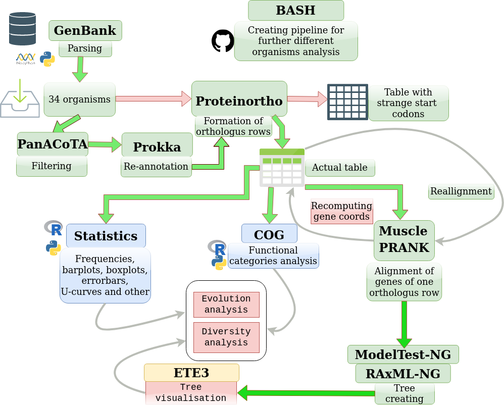

# Non-canonical start-codons and where to find them
Project about the evolution of non-canonical start-codons in bacteria and connections between gene function and its start-codon.

## Table of content

[Structure of repository](https://github.com/Asklepiad/BI_project_2022/tree/main#structure-of-repository)

[Introduction](https://github.com/Asklepiad/BI_project_2022/tree/main#introduction)

[Aims and objectives](https://github.com/Asklepiad/BI_project_2022/tree/main#aims-and-objectives)

[Data](https://github.com/Asklepiad/BI_project_2022/tree/main#data)

[Workflow](https://github.com/Asklepiad/BI_project_2022/tree/main#workflow)

[Workflow plan and technical properties](https://github.com/Asklepiad/BI_project_2022/tree/main#workflow-plan-and-technical-properties)

[Installation](https://github.com/Asklepiad/BI_project_2022/tree/main#installation)

[Options](https://github.com/Asklepiad/BI_project_2022/tree/main#options)

[Example input and output](https://github.com/Asklepiad/BI_project_2022/tree/main#example-input-and-output)

[Results and discussion](https://github.com/Asklepiad/BI_project_2022/tree/main#results-and-discussion)

[Future plans](https://github.com/Asklepiad/BI_project_2022/tree/main#future-plans)

[Literature](https://github.com/Asklepiad/BI_project_2022/tree/main#literature)

[Links](https://github.com/Asklepiad/BI_project_2022/tree/main#links)

[Authors](https://github.com/Asklepiad/BI_project_2022/tree/main#authors)

[Feedback](https://github.com/Asklepiad/BI_project_2022/tree/main#feedback)

## Structure of repository

> Scripts

Conda environment creator for pipeline, master script, all components of pipeline, some additional scripts and requirements file are located in the `scripts` folder. You can read a more detailed description of the folder content in the `scripts` folder [readme](./scripts/README.md).

> Data

All data for reproducing our investigation and json file for test run are situated in the `data` folder. You can read a short description of the folder content in the `data` folder [readme](./data/README.md).

> Test output

The test running on *Salinibacter ruber* results are situated in the `output_example` folder . You can read a short description of the folder content in  the `output_example` folder [readme](./output_example/S_ruber/data/README.md).

> Illustrations

The images for illustrating the repositry's readme files are located in the `illustrations` folder.

## Introduction

It is known procaryotes have non-only ATG as a start-codon. There are about 10% genes in the bacterial genome (a more strict proportion depends on taxon) with non-canonical start-codons (NCSCs): GTG, TTG and some others in negligibly small proportion. There are not very much data about the causes of the existance and "gene preferences" of NCSCs. The GTG and TTG usually bind weaker with the ribosome relative to canonical ATG start-codon.

## Aims and objectives

1. Find the connection between the function of genes and the canonicity of its start-codon.
2. Evaluate the distribution of bacterial NCSCs from different taxons and ecological niches, and find the difference (if it exists) between different groups of bacteria by their function-start-codons patterns.
3. Create a pipeline for analysing bacteria.
4. Run pipeline on many organisms from different taxons and ecological niches.

## Data

The first stage of the investigation was done on thirty-four bacterial species. A complete list of species is available on the `data/all_species.txt` file. Species were selected by material D. Nikolaeva's article preprint about generalists and specialists (*article haven't been published yet, therefore we can't post any reference or link*).

The json file with precomputed links is situated in `data/id_lists.json`. This file is the main part complete pipeline's input.

## Workflow

The principal scheme of the pipeline is in the figure below. 

### Workflow plan and technical properties

#### Technical properties
> The pipeline was run on the local machine with OS Ubuntu 20.04. The package manager was conda 23.3.1 (miniconda). Python version was 3.9.13. R version was 4.2.2 Bash version was 5.0.17(1)-release (x86_64-pc-linux-gnu).

> The pipeline was run on the server with CentOS Linux release 8.5.2111. The package manager was conda 23.3.1 (anaconda). Python version in an appropriate virtual environment was 3.9.13. R version was 4.2.2 Bash version was 4.4.20(1)-release (x86_64-redhat-linux-gnu). The workload manager was SLURM 20.11.9-3.1

#### Workflow plan
 There are thirteen scripts in the pipeline properly (including two versions of master-script) and some scripts for preparing data.
 
##### Master scripts

There are two master scripts in the pipeline for two modes of computing. 
- The more flexible variant is ```folder_creators_server0.sh```. It creates all appropriate directories and subdirectories for one bacteria in input. Use script ```server_executor_start_codons.sbatch``` for the running commands on servers with slurm. Despite of script name, it may be used both on the server and locally (the name's first part has only historical meaning))
- The more common way is using one ```json.sh``` script to rule them all.
- In addition, you can use the parts of pipeline separately. 

##### Pipeline parts properly

1. ```Parsing_NCBI_1.py``` - creates a list of genbank assemblies with annotations and data about plasmid files (it is important because information about the type of DNA molecules will vanish on the next stage).
2. ```prokka_annotate2.sh``` - consistently reannotates assemblies. You can read more about the Prokka tool on [its github](https://github.com/tseemann/prokka). We used version 1.14.6.
3. ```First_table_creating3.py``` - creates a table about gene features and fasta files with all genes.
4. ```proteinortho_script4.sh``` - computes ortologous rows and creates a table with information about them. You can read more about the Proteinortho tool on [its gitlub](https://gitlab.com/paulklemm_PHD/proteinortho). We used version 6.1.7.
5. ```Muscle_preparing_5.py``` - creates two big summary tables about genes and ortologous rows.
6. ```Statscript.R``` - computes different statistics, creates figures and a short report.
7. ```muscle_align6.sh``` or ```prank_align6.sh``` aligns sequences. You can read more about the MUSCLE and PRANK aligners respectively on the [MUSCLE v.5 website](https://www.drive5.com/muscle/) and [PRANK website](http://wasabiapp.org/software/prank/). We used version 5.1 and v.170427 of MUSCLE and PRANK respectively.
8. ```modeltree_maker7.sh``` - chooses the best evolution model for further tree creating. You can read more about the modeltest-ng tool on [its github](https://github.com/ddarriba/modeltest). We used version 0.1.7.
9. ```raxml_tree8.sh``` - creates phylogenetic trees in Newick format. You can read more about the RAxML-ng tool on [its github](https://github.com/amkozlov/raxml-ng). We used version 1.1.0.
10. ```Ete3_maker_10.py``` - visualizes phylogenetic trees (*unavailable in server version now*)

##### Additional scripts

- ```Check_strains_04.py``` finds "bad" assemblies with many genes in ortologous rows with gaps on start positions. The script will be implemented in the extended version of the pipeline, as part of the "believer" module.

- ```Download_strains_03.py``` downloads genomes from NCBI, dividing organisms by the number of assemblies. The script's work's result is an input for a PanACoTa pipeline which excludes evolutionary close organisms. You can read more about PanACoTA on [its github](https://github.com/gem-pasteur/PanACoTA). Then script processed an output of the PanACoTA pipeline, returns json file with a dictionary, where the key is bacteria's name, and value is a list of links.

- ```environments_script_01.sh``` creates conda virtual environments. If you want to use another virtual environment, or want to set them manually, or run all programmes from the base conda environment (we highly recommend not to do that), you need to rewrite running scripts and environments names in```folder_creators_server0.sh``` .

- ```local_statscript.R```  - local analogue for semi-hand (target organism name must be written handly) computing statistics of ```Statscript.R```. It is convenient to run the script in RStudio.

- ```common_statistics.R``` - computes statistics by all dataset of bacterias. Draws barplots and boxplots which rebuts SCs distribution between bacterial species.

##### Sbatch scripts

For working on the server with [slurm](https://slurm.schedmd.com/documentation.html) we have prepared some sbatch scripts. You can customize some points of the script and add some new ones, if you need (time, as an example).

- ```server_executor_start_codons.sbatch``` runs ```json.sh``` script, which starts analysis of all bacteria in the input file.

- ```one_genome.sbatch``` runs ```server_executor_start_codons.sbatch```, which starts to analyze only one bacteria.

- ```executor_partial.sbatch``` runs one script from pipeline. It may be useful if you have some exceptions with one of the "terminal" scripts (```Statscript.R``` or ```Ete3_maker_10.py```).

### Installation

For the start of the work, you need to clone this repository on the local machine or on the server. 
Firstly you need to have the conda on your machine. You can check the existance of the conda if you will type `conda` in the command line. If you haven't conda, download it from the [version archive](https://repo.anaconda.com/archive/). You need to choose your OS for downloading. We recommend you download the latest version of the conda.


1. You need to clone the repository.
 1. Touch the button `code` on the upper right corner of the screen.
 2. Copy the https address.
 3. Open the command line with bash.
 4. Change the directory, using the `cd` command, until you open the directory, where you want to copy the repository.
 5. Type ```git clone <https you have copied on the previous stage>```
2. After repository had been cloned type ```cd BI_project_2022/scripts``` and after then ```./environments_script_01.sh```
3. When dialogue messages will appeared on the screen, you need to push the `y` button and enter. It will occur some times.
4. You are ready for the analysis.

### Options

There are slightly different options, when you run master-script ```folder_creators_server0.sh``` or ```json.sh```. There are 5 options needed in both cases 

1. If you run ```json.sh``` you need to send the below-defined options:
- path to json file with all ids for every bacteria. 
- aligner. There are two variants now: muscle and prank
- proteinortho identity parameter. We recommend use value near 75 for analyzys on specie level. 
- Email. It needs for decreasing limitations of NCBI downloading files.
- Number of threads for parallelizing some utilities.
> Example: ```./json.sh "../data/id_lists.json" "muscle" 75 "vibrio.choleri.1854@gmail.com" 24```

2. If you run ```folder_creators_server0.sh``` you need to send the below defined options:
- name of json file in "../data/jsons" directory (path has been written relative to folder with scripts)
- aligner. There are two variants now: muscle and prank
- proteinortho identity parameter. We recommend to use a value near 75 for analysis on the specie level. 
- Email. It needs for decreasing the limitations of NCBI downloading files.
- Number of threads for parallelizing some utilities.
> Example: ```./folder_creators_server0.sh "S_ruber.json" "muscle" 75 "bogdan.sotnikov.1999@mail.ru" 24```

### Example input and output

We will demonstrate an example of the alalyzis of one bacteria.

- Input You need all pipeline scripts (except sbatch files if you run it on the local machine), `./data/bigcog` folder with all files and `./data/file_complete_genomes.json` or `/data/jsons/<Bacteria_of_interest.json>` files. If you have file_complete_genomes.json you may use `Organisms_parsing02.py` for parsing it. The script will create `/data/jsons/` folder with 34 json files, one of which will be `S_ruber.json`. Then you will need to run the following command from the scripts directory: ```./folder_creators_server0.sh "S_ruber.json" "muscle" 75 "<your e-mail>" <number of your threads> 2>sruber.err```

- Output is located in the output_example folder. It has two folders: figures contents pictures phylogenetical trees (in the same-name subdirectory) and plots; data contents table with data, json intermediate files, tools' outputs, alignments, phylogenetical trees in Newick format and many others. More information you may find in `./output_example/S_ruber/data` folder's readme file.

### Problems and errors

There are problems with ete3 executing on the server (the local version works well) now. It will be solved in future (or we will replace ete3 with another tree visualizer).

## Results and discussion

We created a **pipeline** that includes all stages of work: selection, filtering and downloading of bacterial assemblies from NCBI, re-annotation of sequences, construction of orthologous rows, alignment of genes within orthologous rows, calculation of statistics, analysis of COG categories, construction of trees.

#### Start codon distribution analysis. 
We had 3 hypotheses about the dependence of the distribution of start codons on:
1. the size of the genome
2. phylogeny
3. belonging of bacteria to specialists and generalists.

Legend for 2 next graphs:


Hypotheses 1 and 3 were not confirmed: no correlation was found between the representation of start codons depending on the size of the genome and whether the bacterium belongs to generalists and specialists. But we were able to identify some dependencies in the analysis of the distribution of start codons in bacteria grouped by taxa. Representatives of the taxon Pseudomonadota had a lower percentage of genes with non-canonical start codons compared to representatives of the taxon Bacillota considered in this work.

#### Distribution of start codons in genes with different COG category analysis. 
We analyzed the distribution of genes by COGs within each organism (we took all the genes with a certain start codon (ATG, GTG, TTG) and looked at what proportion of them belonged to one or another COG) (the relative percentage was calculated).


In genes responsible for: 
* amino acid metabolism
* carbohydrate metabolism
* energy production and conversion

the relative percentage of the **canonical ATG start codon** is greater than that of non-canonical ones.

In genes responsible for:
* the central dogma of molecular biology
* the cell cycle
* mobility
* cell wall
* intracellular transport
* vesicle formation

the relative percentage of **non-canonical start codons GTG or TTG** is greater than the canonical one.

This observation provides us with a good basis for further analysis of the preferences of individual genes for non-canonical start codons.


## Future plans

1. Run pipeline on bigger amount of bacteria for verification hypotheses, created on this stage of the investigation.
2. Improve quality control and belief in finding the position of the start-codon (creating the "belivier" module with some checkpoint and data filtering points).
3. Found candidate genes for experimental verification in a wet lab.

## Literature

1. Belinky, F., Rogozin, I. B., & Koonin, E. V. (2017). Selection on start codons in prokaryotes and potential compensatory nucleotide substitutions. Scientific reports, 7(1), 12422. https://doi.org/10.1038/s41598-017-12619-6
2. Cao, X., & Slavoff, S. A. (2020). Non-AUG start codons: Expanding and regulating the small and alternative ORFeome. Experimental cell research, 391(1), 111973. https://doi.org/10.1016/j.yexcr.2020.111973
3. Galperin, M. Y., Kristensen, D. M., Makarova, K. S., Wolf, Y. I., & Koonin, E. V. (2019). Microbial genome analysis: the COG approach. Briefings in bioinformatics, 20(4), 1063–1070. https://doi.org/10.1093/bib/bbx117
4. Moldovan, M. A., & Gelfand, M. S. (2018). Pangenomic Definition of Prokaryotic Species and the Phylogenetic Structure of Prochlorococcus spp. Frontiers in microbiology, 9, 428. https://doi.org/10.3389/fmicb.2018.00428
5. Costa SS, Guimarães LC, Silva A, Soares SC, Baraúna RA. First Steps in the Analysis of Prokaryotic Pan-Genomes. Bioinformatics and Biology Insights. 2020;14. doi:10.1177/1177932220938064
6. Seemann T. (2014). Prokka: rapid prokaryotic genome annotation. Bioinformatics (Oxford, England), 30(14), 2068–2069. https://doi.org/10.1093/bioinformatics/btu153
7. Lechner, M., Findeiss, S., Steiner, L., Marz, M., Stadler, P. F., & Prohaska, S. J. (2011). Proteinortho: detection of (co-)orthologs in large-scale analysis. BMC bioinformatics, 12, 124. https://doi.org/10.1186/1471-2105-12-124
8. Edgar, Robert. (2021). MUSCLE v5 enables improved estimates of phylogenetic tree confidence by ensemble bootstrapping. bioRxiv10.1101/2021.06.20.449169. 
9. Löytynoja A. (2014). Phylogeny-aware alignment with PRANK. Methods in molecular biology (Clifton, N.J.), 1079, 155–170. https://doi.org/10.1007/978-1-62703-646-7_10
10. Darriba, D., Posada, D., Kozlov, A. M., Stamatakis, A., Morel, B., & Flouri, T. (2020). ModelTest-NG: A New and Scalable Tool for the Selection of DNA and Protein Evolutionary Models. Molecular biology and evolution, 37(1), 291–294. https://doi.org/10.1093/molbev/msz189
11. Kozlov, A. M., Darriba, D., Flouri, T., Morel, B., & Stamatakis, A. (2019). RAxML-NG: a fast, scalable and user-friendly tool for maximum likelihood phylogenetic inference. Bioinformatics (Oxford, England), 35(21), 4453–4455. https://doi.org/10.1093/bioinformatics/btz305

## Links

- [PROKKA github](https://github.com/tseemann/prokka)
- [Proteinortho gitlub](https://gitlab.com/paulklemm_PHD/proteinortho)
- [MUSCLE v.5 website](https://www.drive5.com/muscle/)
- [PRANK website](http://wasabiapp.org/software/prank/)
- [Modeltest-ng github](https://github.com/ddarriba/modeltest)
- [RAxML-ng github](https://github.com/amkozlov/raxml-ng)
- [PanACoTA github](https://github.com/gem-pasteur/PanACoTA)
- [Conda version archive](https://repo.anaconda.com/archive/)
- [Slurm documentation](https://slurm.schedmd.com/documentation.html)

## Authors

 - Rubinova Valeria Sergeevna (Bioinformatics institute)
 - Sotnikov Bogdan Vladimirovich (Kyrgyz-Russian Slavic university, Bioinformatics institute)
 - Bochkareva Olga Olegovna* (Institute of Science and Technology Austria)

\* project supervisor 

## Feedback

You can read about any problems or ideas about project improvements on **(вставить контакты)**
